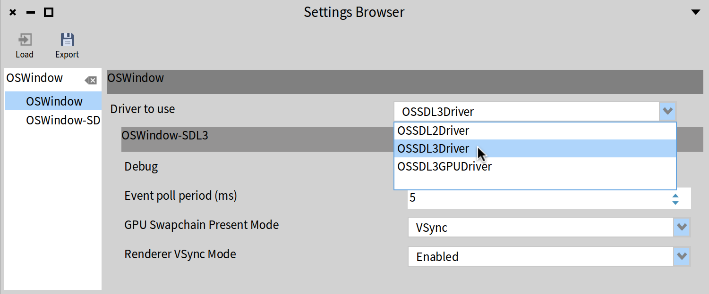

# PharoSDL3

Pharo Smalltalk bindings for [SDL (Simple DirectMedia Layer)](https://github.com/libsdl-org/SDL) version 3.0.

SDL is a cross-platform development library designed to provide low-level access to audio, keyboard, mouse, joystick, and graphics hardware. It is used by video playback software, emulators, and games.

[](https://opensource.org/licenses/MIT)
[](https://github.com/pharo-graphics/PharoSDL3/actions/workflows/test.yml)

## Installation

### 1. Load the Pharo project

In a Pharo 14 image, evaluate the following Metacello script:

```smalltalk
Metacello new
    baseline: 'SDL3';
    repository: 'github://tinchodias/PharoSDL3:dev/src';
    load
```

Alternatively, from your terminal:
```bash
curl https://get.pharo.org/140+vmLatest | bash
./pharo Pharo.image metacello install --save github://tinchodias/PharoSDL3:dev/src SDL3
```

### 2. Ensure SDL3 library is available

Since end of June/2026, the Pharo 14 **"latest"** VM ships SDL3 for Mac and Windows (not Linux yet). Find below other options to ensure the SDL3 library is available on your system so Pharo's FFI can find it.
- **MacOS:** `brew install sdl3`
- **Linux:** Build from [source](https://github.com/libsdl-org/SDL/blob/main/INSTALL.md) or use your package manager.
- **Windows:** Download the DLL from [SDL releases](https://github.com/libsdl-org/SDL/releases) and place it in the same folder as your Pharo image.


## New OSWindow Drivers

The System Settings provide an option to establish the OSWindow driver. Search for "OSWindow":


You can force the driver from an environment variable, from terminal:
1. Download Pharo 14 via zeroconf script as described above
2. Load this project's baseline
3. Save and Close
4. Run in terminal: `PHARO_WINDOW_DRIVER=OSSDL3Driver ./pharo-ui Pharo.image`
5. Verify that `OSWindowDriver current` answers a `OSSDL3Driver`

Other options define the strategy for refreshing the window & VSYNC. The `OSBenchmarkMorph` can show metrics and visuals related to such options.


## Demos & Tests

The project includes automated tests as well as interactive demos. These demos complement automated testing by allowing for human verification of visual rendering and event handling.

**Important:** Pharo's UI and SDL2 (used by default in Pharo 14) conflict with SDL3's subsystems. It is recommended to run SDL3 tests and demos in **headless mode** or ensure proper work.

### Tests

Run tests from the terminal:
```bash
./pharo Pharo.image test 'SDL3-Tests' 'SDL3-GPU-Tests'
```

([This video](https://youtu.be/v812EpMevKQ)) shows how to run `SDL3WindowTest>>#test12ShapedWindow`.

### Demos

You can run any of the following demos by evaluating `./pharo Pharo.image eval '<ClassName> new run'` from terminal. They are listed below from simplest to most advanced:

#### Core API Demos
- `SDL3ClearDemoApp`: The basic "Hello World" of **window management** and rendering clear operations.
- `SDL3LogEventsDemoApp`: Real-time logging of the SDL3 **event stream** (mouse, keyboard, window) to a console.
- `SDL3SystemQueryDemoApp`: Queries system and device properties like **display modes**, **audio drivers**, and **video drivers**.
- `SDL3DisplayDemoApp`: Visualizes logical **display layouts**, hardware specs, and multiple display boundary frontiers.
- `SDL3MouseDemoApp`: Mouse-related functions including **grabbing**, **relative mode**, **window confinement**, **warping**, and **system cursors**.
- `SDL3KeyboardDemoApp`: Low-level keyboard state monitoring (**scancodes**, **keycodes**, **modifiers**) and **Unicode text input**.
- `SDL3WindowChildrenDemoApp`: Parent/child window relationships including **utility**, **tooltip**, **popup menu**, and **modal** behaviors.
- `SDL3AnimatedCursorDemoApp`: Creation and usage of custom **animated cursors** from image frames ([Video](https://youtube.com/shorts/r7KVAxjZ70w?feature=share)).
- `SDL3MultiWindowDemoApp`: Management and update loops for multiple top-level windows simultaneously.
- `SDL3TouchpadDemoApp`: **Multi-touch** finger tracking ([Video](https://youtube.com/shorts/xlDduwDMxZw?feature=share)).
- `SDL3TouchpadZoomDemoApp`: Smooth zooming gestures utilizing complex **touchpad pinch events**.
- `SDL3AudioRecorderDemoApp`: **Audio capture** from the system's default microphone and playback.
- `SDL3CameraDemoApp`: Live frame acquisition from a camera with horizontal mirror support.
- `SDL3TrayMenuDemoApp`: **System tray** integration, including icon management and contextual menus ([Video](https://youtu.be/L6Mw00fW1bE)).
- `SDL3ImageClipboardDemoApp`: **System clipboard** integration for copying and pasting image data.
- `SDL3FolderDialogDemoApp`: Native system **file/folder selection dialogs**.

#### GPU API Demos (Advanced Graphics)
- `SDL3GPUClearDemoApp`: The simplest entry point to the hardware-accelerated GPU API, showing basic **render pass** and **clear color** setup.
- `SDL3GPURenderStateDemoApp`: Simplified use of the **graphics pipeline** via the `SDL_Renderer` API. ([Video](https://www.youtube.com/watch?v=94hMw9pPvBQ))
- `SDL3GPUQuadDemoApp`: Foundations of geometry: rendering a textured quad using **vertex buffers**, **index buffers**, and **UV mapping** ([Video](https://youtube.com/shorts/j4yIu-TdR0o?feature=share)).
- `SDL3GPURoundedRectDemoApp`: Perfectly anti-aliased procedural shapes using **Signed Distance Fields (SDF)** and **fragment shaders** ([Video](https://youtube.com/shorts/fpLCFB_mvW8?feature=share)).
- `SDL3GPUShimmerDemoApp`: Mock UI with a loading effect utilizing **time uniforms** and **procedural shader generation** ([Video](https://youtu.be/GNoRRP7irXs)).
- `SDL3GPUInstancedQuadDemoApp`: High-performance rendering of thousands of objects using **hardware instancing** and **instance buffers**.
- `SDL3TextScrollDemoApp`: Smooth text scrolling of a large file utilizing a **texture atlas** and **instanced quad rendering**.
- `SDL3GPUBlurComputeDemoApp`: Real-time image processing utilizing **compute shaders**, **storage textures**, and a **Gaussian blur** algorithm.
- `SDL3GPUKawaseBlurDemoApp`: Multi-pass **post-processing** effect demonstrating **ping-pong buffers**, **downsampling/upsampling**, and a **Dual Kawase Blur** ([Video](https://youtu.be/t0MlKdq3KHs)).
- `SDL3GPUBoidsDemoApp`: High-performance **particle system** using a **compute-to-vertex-buffer** architecture for a flocking simulation ([Video](https://www.youtube.com/watch?v=-6wztetR5qg)).
- `SDL3GPUNodeForceDemoApp`: Force-directed graph simulation utilizing **N-body physics** in a **compute shader** ([Video](https://youtube.com/shorts/hl3kqMp0tao?feature=share)).


### Helper Scripts

The project includes shell scripts in `scripts/`:

- **`scripts/smokeTestDemos.sh`**: Runs each demo sequentially for few seconds to verify startup, execution, and clean shutdown without throwing errors or crashing. Collects all results and reports a summary.
  ```bash
  # Run all demos (defaults to ./pharo Pharo.image)
  ./scripts/smokeTestDemos.sh

  # Filter demos by substring (e.g. GPU demos)
  ./scripts/smokeTestDemos.sh GPU

  # Custom Pharo VM/Image path
  ./scripts/smokeTestDemos.sh GPU "./pharo Pharo.image"
  ```

- **`scripts/benchOSWindow.sh`**: Runs `OSBenchmarkMorph` against multiple OSWindow drivers to collect windowing benchmarks.
  ```bash
  # Run benchmarks with default ./pharo-ui Pharo.image
  ./scripts/benchOSWindow.sh

  # Run and record results to a file for comparison
  ./scripts/benchOSWindow.sh | tee -a results.txt

  # Custom Pharo launcher and image
  ./scripts/benchOSWindow.sh "./pharo-ui MyImage.image" | tee -a results.txt
  ```

## Mapping SDL3 Functions to Pharo Methods

The bindings follow a consistent naming convention to map C functions to Pharo methods.

GENERAL TIP: Given a SDL3 C name (e.g. `SDL_` function, struct or constant), in Pharo you can select the string -> open context menu -> "**Code search**" -> "**Method source with it**", and you should find where in the project it is used or defined.

### 1. Raw API
The `LibSDL3` class provides direct access to the C API.
- **Prefix Removal:** The `SDL_` prefix is removed.
- **CamelCase:** The first letter of the function name is lowercased.
- **Keywords:** Function parameters are converted into Pharo keywords.
- **Argument Naming:** Arguments are named using `camelCase` (e.g., `numThreads` instead of `num_threads`).

You can browse [a mapping table](../../wiki/Low%E2%80%90level-API) in our wiki with a complete mapping from SDL functions to each Pharo method in `LibSDL3`.

**Examples:**
- `SDL_Init(flags)` maps to `LibSDL3 >> init: flags`
- `SDL_CreateWindow(title, w, h, flags)` maps to `LibSDL3 >> newWindowTitle:w:h:flags:`

### 2. Convenience API (Instance-Side methods in SDL3Window and others)

Object-oriented classes like `SDL3Window` and `SDL3Renderer` (We may call them "Independent root objects") provide more idiomatic Smalltalk methods.

- **Accessors:** Getter and setter functions are converted to Smalltalk-style accessors by omitting the `Get` and `Set` prefixes.
  - `SDL_GetWindowFlags(window)` maps to `SDL3Window >> flags`
  - `SDL_SetWindowBordered(window, bordered)` maps to `SDL3Window >> bordered: bordered`
- **Output Parameters (Into):** When a function returns values via pointers (output parameters), the Pharo method typically uses the `Into` keyword in the selector.
  - `SDL_GetWindowSize(window, &w, &h)` maps to `SDL3Window >> getSizeIntoW:w h:h`
  - `SDL_GetRenderClipRect(renderer, &rect)` maps to `SDL3Renderer >> getRenderClipRectInto: rect`
- **Argument Naming:** Just like in the raw API, all arguments use `camelCase`.
- **Internal Assertions:** These methods internally perform success assertions, and signal `SDL3Error` if something was wrong in a SDL3 C function call.

You can explore all available functions in the `LibSDL3` class or by browsing the object classes.

### 3. Convenience API for Instance Creation ("Unsafe" Methods)

Independent root classes provide class-side methods for creating or opening resources.

- **Explicit Ownership:** These methods are prefixed with `unsafeNew` (for creation) or `unsafeOpen` (for opening peripherals). This naming convention explicitly signals that the **sender is responsible** for manual memory management (e.g., calling `destroy`, `close`, or `release`). At the moment, PharoSDL3 doesn't provide a `autoRelease`-like way to automatically free the SDL3 external resources, so it is the sender who is responsible of doing it.
- **Internal Assertions:** These methods internally perform success assertions (typically using `assertNotNullReturn`).

**Examples:**
- `SDL3Window unsafeNewTitle: 'title' w: 800 h: 600 flags: 0`
- `SDL3Joystick unsafeOpen: 0`
- `SDL3PropertyGroup unsafeNew`


### 4. GPU Block-Based API (Automatic Lifecycle)

The GPU stack provides specialized methods that use BlockClosures to manage the lifecycle of transient resources (like passes, mapping addresses, or configuration structs). These methods use `ensure:` blocks internally to guarantee that resources are correctly closed, unmapped, or freed, even if an error occurs.

- **Pass Management:** Methods like `renderPassTargets:do:`, `computePassTextures:do:`, and `copyPassDo:` automatically call the underlying `EndGPU...Pass` functions when the block finishes.
- **Safe Resource Creation:** Methods like `newGraphicsPipeline:`, `newSamplerDo:`, and `newBufferDo:` provide a temporary `CreateInfo` struct to the block and automatically free it once the resource is created.
- **Memory Mapping:** `mapTransferBuffer:cycle:do: [ :mappedAddress | ... ]` automatically unmaps the transfer buffer when the block terminates.

**Example:**
```smalltalk
commandBuffer renderPassTargets: targets do: [ :renderPass |
	renderPass
		pipeline: aPipeline;
		drawPrimitives: 3 instances: 1 firstVertex: 0 firstInstance: 0
].
```
The block closure will be preceded by a FFI call to [SDL_BeginGPURenderPass()](https://wiki.libsdl.org/SDL3/SDL_BeginGPURenderPass) and ended with a FFI call to [SDL_EndGPURenderPass()](https://wiki.libsdl.org/SDL3/SDL_EndGPURenderPass).


## Success Assertions

To provide a more idiomatic and safe experience, many wrapper methods in the Convenience API handle error checking internally:

- **Boolean Success:** Methods that return a boolean success code in C (e.g., `SDL_SetWindowBordered()`) use `assertSuccess:` internally. If the call fails, an `SDL3Error` is raised with the message from `SDL_GetError()`. These methods return `self` on success.
- **Pointer Results:** Methods that create or return SDL3 objects (e.g., `newRendererFor:`) use `assertNotNullReturn` internally. If the returned pointer is NULL, an `SDL3Error` is raised.
- **Void Returns:** Methods returning `void` in C (e.g., `destroy`) do not perform assertions and return `self` to allow for method chaining.
- **Query Methods:** Methods that return a state or value (e.g., `isTextInputActive` or `flags`) do not perform internal assertions and return the value directly.

You can explore all available functions in the `LibSDL3` class or by browsing the object classes.


## More Information

* **Is this code generated?** Yes, it was initially generated with [CIG](https://github.com/estebanlm/pharo-cig) and post-processed manually. 
* **Wiki:** Check the [project wiki](../../wiki) for post-processing details and technical documentation.

## License

This project is licensed under the [MIT license](./LICENSE).
